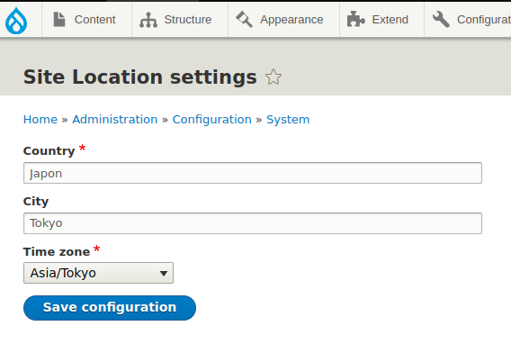

Site Location Drupal Module
------------

Module that allow you to see the Site location
and the current time for the location.


Install
------------
Installing site location custom module:
```bash
drush en site_location
```

Settings Form
------------

Go to `/admin/config/system/site-location` and configure it!



Working on
------------
```bash
 Drupal version   : 9.3.6
 Site URI         : https://mysite.ddev.site
 DB driver        : mysql
 DB hostname      : db
 DB port          : 3306
 DB username      : db
 DB name          : db
 Database         : Connected
 Drupal bootstrap : Successful
 Default theme    : olivero
 Admin theme      : seven
 PHP binary       : /usr/bin/php7.4
 PHP config       : /etc/php/7.4/cli/php.ini
 PHP OS           : Linux
 Drush script     : /var/www/html/vendor/drush/drush/drush
 Drush version    : 11.0.5
 Drush temp       : /tmp
 Drush configs    : /var/www/html/vendor/drush/drush/drush.yml
 Install profile  : standard
 Drupal root      : /var/www/html/web
 Site path        : sites/default
 Files, Public    : sites/default/files
 Files, Temp      : /tmp
```
